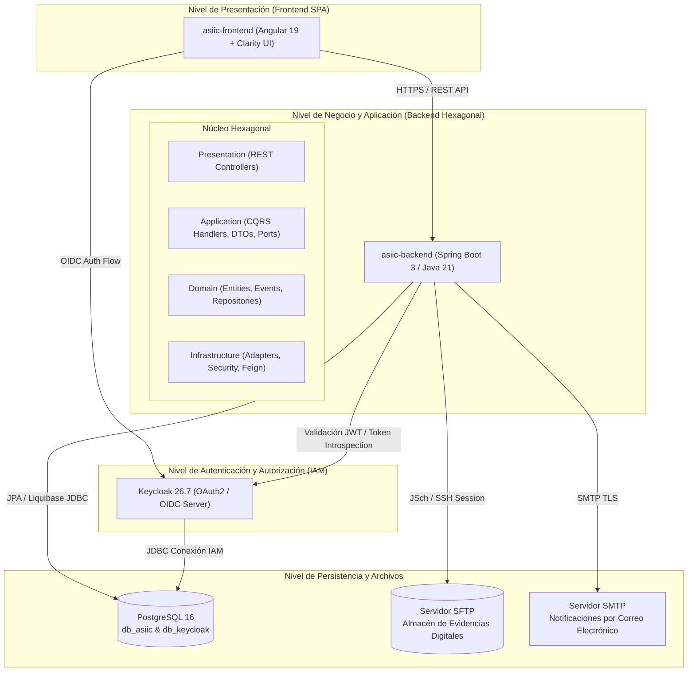

# ASIIC — Sistema Integral de Información y Control Municipal

---

### **DOCUMENTO DE DESCRIPCIÓN DE DISEÑO DE SOFTWARE (SDD)**
**Código de Identificación:** `ASIIC-SDD-IEEE-1016-2026-v1.0`  
**Estándares de Referencia:**  
- **IEEE Std 1016-2009:** *IEEE Standard for Information Technology — Systems Design — Software Design Descriptions (SDD)*  
- **ISO/IEC/IEEE 12207:2017:** *Systems and software engineering — Software life cycle processes*  
- **IEEE Std 828-2012:** *IEEE Standard for Configuration Management in Systems and Software Engineering*  
- **IEEE Std 830-1998:** *IEEE Recommended Practice for Software Requirements Specifications (SRS)*  
**Institución / Proyecto:** ASIIC — Universidad Mariano Gálvez / Gestión Municipal  
**Fecha de Publicación:** Septiembre 2026  
**Estado:** Oficial / Arquitectura Base de Referencia  

---

## 1.0 INTRODUCCIÓN Y PROPÓSITO DEL DOCUMENTO

### 1.1 Propósito
El presente documento describe formalmente la organización de archivos, directorios, módulos y capas arquitectónicas del proyecto **ASIIC (Sistema Integral de Información y Control Municipal)**. Este documento sigue las directrices establecidas en el estándar internacional **IEEE Std 1016-2009**, proporcionando una vista de descomposición (*Decomposition View*), una vista de diseño de dependencias (*Dependency View*) y una vista de interfaces (*Interface View*) para asegurar la trazabilidad, mantenibilidad, auditabilidad y extensibilidad del sistema a lo largo de su ciclo de vida de desarrollo.

### 1.2 Alcance del Sistema
ASIIC es una plataforma tecnológica distribuida orientada a la modernización de servicios municipales para la atención ciudadana. Proporciona:
1. **Portal Vecinal de Autogestión:** Registro de ciudadanos con validación formal de CUI (Código Único de Identificación), domicilio y número telefónico; consulta y seguimiento de trámites en tiempo real.
2. **Recepción y Trámite de Incidencias:** Registro multicanal de quejas, reclamos, sugerencias y denuncias ciudadanas, permitiendo adjuntar evidencia multimedia, vincular testigos, georreferenciar hechos y resguardar datos de privacidad.
3. **Flujo de Trabajo y Estados (Workflow State Machine):** Motor de transiciones de ciclo de vida de las incidencias (Ingreso, Verificación, Asignación, Inspección de Campo, Resolución y Notificación).
4. **Infraestructura de Seguridad y Almacenamiento Centralizado:** Gestión de Identidad y Acceso (IAM) con protocolo OpenID Connect / OAuth2, soporte de tokens criptográficos temporales y repositorio de expedientes digitales con almacenamiento SFTP seguro.

### 1.3 Taxonomía, Acrónimos y Glosario Técnico
Conforme a las directrices de terminología del IEEE:

| Acrónimo / Término | Definición Formal |
| :--- | :--- |
| **ASIIC** | Aplicación / Sistema Integral de Información y Control Municipal. |
| **CQRS** | *Command Query Responsibility Segregation* (Segregación de Responsabilidad de Comandos y Consultas). |
| **DDD** | *Domain-Driven Design* (Diseño Guiado por el Dominio). |
| **DTO** | *Data Transfer Object* (Objeto de Transferencia de Datos entre capas). |
| **IAM** | *Identity and Access Management* (Gestión de Identidades y Accesos). |
| **OIDC / OAuth2** | *OpenID Connect / Open Authorization 2.0* (Estándares abiertos de autenticación federada y autorización). |
| **RBAC** | *Role-Based Access Control* (Control de Acceso Basado en Roles). |
| **RDBMS** | *Relational Database Management System* (Sistema Gestor de Bases de Datos Relacionales - PostgreSQL). |
| **SFTP** | *SSH File Transfer Protocol* (Protocolo Seguro de Transferencia de Archivos). |
| **SPA** | *Single Page Application* (Aplicación de Página Única - Angular). |
| **CUI** | Código Único de Identificación del Registro Nacional de las Personas (RENAP, Guatemala). |

---

## 2.0 VISTA ARQUITECTÓNICA GLOBAL DEL SISTEMA (IEEE 1016 §4)

El sistema implementa una arquitectura desacoplada basada en el patrón de **Arquitectura Hexagonal (Ports & Adapters)** en el servidor de aplicaciones, complementado con el patrón **CQRS** para optimizar la separación funcional entre mutaciones de estado y consultas de lectura. La capa de cliente opera como una **SPA** reactiva en Angular, mientras que la infraestructura de soporte se encuentra orquestada mediante contenedores Docker.



---

## 3.0 ESPECIFICACIÓN Y DOCUMENTACIÓN ESTRUCTURAL DE DIRECTORIOS (IEEE 1016 §5)

### 3.1 Árbol Jerárquico General del Repositorio

```text
asiic-application/
├── asiic-backend/          # [SUBSISTEMA 1] Servidor de API REST y Dominio de Negocio (Spring Boot / Java 21)
├── asiic-frontend/         # [SUBSISTEMA 2] Cliente Web y Portal Vecinal (Angular 19 / Clarity Design)
├── asiic-composer/         # [SUBSISTEMA 3] Orquestación de Infraestructura y Contenedores (Docker Compose)
├── asiic-diagramas/        # [SUBSISTEMA 4] Modelos de Ingeniería de Software y Especificaciones (StarUML .mdj)
└── asiic-migraciones/      # [SUBSISTEMA 5] Staging de Scripts SQL DDL/DML y Migraciones Complementarias
```

---

### 3.2 Subsistema 1: `asiic-backend/` (Núcleo de Servicios Empresariales)

* **Ruta Base:** `asiic-backend/`
* **Tecnología Principal:** Java 21, Spring Boot (4.1.0-parent / 3.x), Maven, Spring Security OAuth2, Spring Data JPA, Liquibase, JSch SFTP.
* **Patrón de Diseño:** Clean Architecture / Hexagonal Architecture con CQRS (*Command Query Responsibility Segregation*).
* **Responsabilidad:** Gestionar las reglas del negocio municipal, validar identidades ciudadanas, orquestar el ciclo de vida de incidencias, registrar evidencias digitales, auditar eventos y exponer servicios RESTful seguros.

```text
asiic-backend/
├── pom.xml                                 # Descriptor de dependencias Maven y configuración del ciclo de vida de compilación
├── mvnw / mvnw.cmd                         # Maven Wrapper para compilación unificada multiplataforma
├── lombok.config                            # Configuración de compilación para generación de código con Project Lombok
├── keys/                                   # Almacén de credenciales y claves privadas para conexión SFTP segura
│   └── sftp_key                            # Llave SSH privada para conexión al servidor SFTP
├── src/
│   ├── main/
│   │   ├── java/com/assic/muni/            # Código fuente principal de la aplicación Java
│   │   │   ├── AssicSystemApplication.java # Punto de entrada principal y bootstrap de Spring Boot
│   │   │   ├── domain/                     # CAPA 1: Dominio Empresarial Puro (Entidades, Eventos, Repositorios)
│   │   │   │   ├── model/                  # Entidades JPA y Modelos de Dominio del Negocio Municipal
│   │   │   │   │   ├── AsIncidencia.java            # Entidad maestra de incidencias (quejas, reclamos, denuncias)
│   │   │   │   │   ├── AsVecino.java                # Datos del ciudadano/vecino registrado
│   │   │   │   │   ├── AsPersona.java               # Datos personales (CUI, nombres, apellidos, género)
│   │   │   │   │   ├── AsDomicilio.java             # Entidad de dirección física y residencia
│   │   │   │   │   ├── AsCorreo.java / AsTelefono.java # Canales de contacto validados
│   │   │   │   │   ├── AsArchivo.java               # Metadatos del archivo digital almacenado
│   │   │   │   │   ├── AsIncidenciaArchivo.java     # Relación asociativa incidencia-archivo adjunto
│   │   │   │   │   ├── AsDenunciado.java            # Registro de sujeto o entidad denunciada
│   │   │   │   │   ├── AsTestigo.java               # Registro de testigos presenciales
│   │   │   │   │   ├── AsCatalogo.java              # Tablas de catálogos paramétricos del sistema
│   │   │   │   │   ├── AsLocacion.java              # Georreferenciación (departamentos, municipios, zonas)
│   │   │   │   │   └── AsInsidenciaEstado.java      # Histórico y estado de incidencias
│   │   │   │   ├── repository/             # Interfaces de Repositorio (Spring Data JPA)
│   │   │   │   │   ├── AsIncidenciaRepository.java  # Acceso a datos de incidencias y consultas optimizadas
│   │   │   │   │   ├── AsVecinoRepository.java      # Acceso a datos de ciudadanos registrados
│   │   │   │   │   ├── AsArchivoRepository.java     # Acceso a metadatos de archivos
│   │   │   │   │   └── AsCatalogoRepository.java    # Consultas de catálogos del sistema
│   │   │   │   ├── event/                  # Eventos de Dominio del Negocio
│   │   │   │   │   ├── VecinoCreadoEvent.java       # Evento disparado tras registrar un nuevo vecino
│   │   │   │   │   ├── CuentaConfirmadaEvent.java   # Evento de validación exitosa de cuenta
│   │   │   │   │   ├── IncidenciaUpsertEvent.java   # Evento de creación/actualización de incidencia
│   │   │   │   │   └── RegistrarEvidenciasEvent.java# Evento de vinculación de evidencias multimedia
│   │   │   │   └── enums/                  # Enumeraciones de dominio (IncidenciaEvent, IncidenciaState)
│   │   │   ├── application/                # CAPA 2: Casos de Uso y Servicios de Aplicación (CQRS)
│   │   │   │   ├── cqrs/
│   │   │   │   │   ├── cmd/                # Comandos de Mutación (State Mutation Commands)
│   │   │   │   │   │   ├── RegistrarVecinoCmd.java  # Solicitud de registro de ciudadano
│   │   │   │   │   │   ├── ConfirmarCuentaCmd.java  # Activación de cuenta mediante token temporal
│   │   │   │   │   │   ├── IncidenciaPayloadCmd.java# Payload de registro/actualización de incidencia
│   │   │   │   │   │   └── LoginCmd.java            # Solicitud de inicio de sesión
│   │   │   │   │   ├── handler/            # Manejadores de Comandos y Consultas (Command/Query Handlers)
│   │   │   │   │   │   ├── RegistrarVecinoCmdHandler.java   # Orquestador del alta vecinal
│   │   │   │   │   │   ├── UpsertIncidenciaCmdHandler.java  # Gestión transaccional de incidencias
│   │   │   │   │   │   ├── IncidenciaQueryHandler.java      # Consultas desacopladas de incidencias
│   │   │   │   │   │   ├── LoginCmdHandler.java             # Flujo de autenticación con IdP
│   │   │   │   │   │   ├── CatalogoQueryHandler.java        # Recuperación ágil de catálogos
│   │   │   │   │   │   └── ArchivosQueryHandler.java        # Descarga y resolución de archivos
│   │   │   │   │   └── dto/                # Data Transfer Objects (DTO) de entrada/salida
│   │   │   │   ├── port/out/               # Puertos de Salida (Secondary / Driven Ports)
│   │   │   │   │   ├── AuthenticationPort.java  # Contrato de autenticación
│   │   │   │   │   ├── IdentityProviderPort.java# Contrato de comunicación con Keycloak
│   │   │   │   │   ├── FileStoragePort.java     # Contrato de almacenamiento de archivos
│   │   │   │   │   ├── SftpStoragePort.java     # Contrato para protocolo SFTP
│   │   │   │   │   ├── EmailServicePort.java    # Contrato para despacho de correos
│   │   │   │   │   └── TemporalTokenPort.java   # Contrato para generación de tokens JWT efímeros
│   │   │   │   ├── mapper/                 # Mapeadores de Objetos (Entity <-> DTO)
│   │   │   │   ├── group/                  # Validaciones agrupadas por tipo de incidencia (GrpQueja, GrpDenuncia, GrpReclamo)
│   │   │   │   └── util/                   # Utilidades de aplicación (JsonUtil, PayloadValidator, JwtExtractor)
│   │   │   ├── infrastructure/             # CAPA 3: Adaptadores de Infraestructura (Adapters & Integrations)
│   │   │   │   ├── client/keycloak/        # Clientes Feign para Keycloak Admin REST API y Fallbacks
│   │   │   │   ├── config/                 # Clases de configuración de Spring Framework
│   │   │   │   │   ├── KeycloakConfig.java      # Configuración del conector y cliente Keycloak
│   │   │   │   │   ├── SecurityConfig.java      # Configuración del filtro de seguridad y reglas de acceso
│   │   │   │   │   ├── SftpConfig.java          # Configuración del pool y sesión de clientes SFTP
│   │   │   │   │   ├── FeignClientConfig.java   # Configuración de timeouts y codificadores Feign
│   │   │   │   │   └── SwaggerConfig.java       # Documentación OpenAPI 3.0
│   │   │   │   ├── security/               # Adaptadores de Seguridad y Conversión JWT
│   │   │   │   │   ├── JwtAuthConverter.java    # Mapeo de roles de Keycloak a GrantedAuthorities de Spring
│   │   │   │   │   └── JwtTemporalTokenAdapter.java # Generador y validador de tokens temporales de activación
│   │   │   │   ├── service/                # Implementaciones de Puertos de Salida (Out Adapters)
│   │   │   │   │   ├── KeycloakAuthAdapter.java     # Adaptador de autenticación OAuth2 contra Keycloak
│   │   │   │   │   ├── KeycloakProviderAdapter.java # Gestión administrativa de usuarios en Keycloak
│   │   │   │   │   ├── SftpStorageAdapter.java      # Adaptador de almacenamiento remoto SFTP
│   │   │   │   │   ├── SftpFileStorageAdapter.java  # Adaptador de archivos de incidencias sobre SFTP
│   │   │   │   │   └── EmailServicePortImpl.java    # Adaptador de mensajería electrónica SMTP / Thymeleaf
│   │   │   │   ├── listener/               # Consumidores de Eventos de Dominio (@TransactionalEventListener)
│   │   │   │   │   ├── VecinoEventListener.java     # Envío de correo de confirmación de cuenta
│   │   │   │   │   ├── IncidenciaEventListener.java # Auditoría y notificaciones de incidencias
│   │   │   │   │   └── ArchivoEventListener.java    # Transferencia diferida de archivos a almacenamiento
│   │   │   │   └── audit/                  # Registro de auditoría para trazabilidad de transacciones
│   │   │   └── presentation/               # CAPA 4: Controladores de Entrada y Exposición API (In Adapters)
│   │   │       ├── api/
│   │   │       │   ├── pubs/               # Endpoints REST de acceso público (sin token Bearer)
│   │   │       │   │   ├── AuthController.java          # Login, Refresh Token y Logout
│   │   │       │   │   ├── PubVecinoController.java     # Registro ciudadano y confirmación de cuenta
│   │   │       │   │   ├── PubCatalogoController.java   # Consulta pública de catálogos generales
│   │   │       │   │   └── PubLocacionesController.java # Departamentos, municipios y zonas
│   │   │       │   ├── privs/              # Endpoints REST protegidos (requieren RBAC / Token JWT)
│   │   │       │   │   ├── IncidenciasController.java   # CRUD, filtros y descarga de archivos de incidencias
│   │   │       │   │   ├── CatalogoController.java      # Gestión parametrizable de catálogos
│   │   │       │   │   └── DomiciliosController.java    # Consulta y modificación de direcciones
│   │   │       │   └── otrs/               # Manejador Global de Errores
│   │   │       │       └── GlobalExceptionController.java # Mapeo estandarizado de excepciones HTTP RFC 7807
│   │   ├── resources/
│   │   │   ├── application.yaml            # Configuración general de Spring Boot (datasource, mail, sftp, keycloak)
│   │   │   ├── db/                         # Gestión de Base de Datos y Control de Versiones con Liquibase
│   │   │   │   ├── db.changelog-master.yaml# Archivo maestro de orquestación de changelogs de Liquibase
│   │   │   │   └── changelog/              # Scripts de evolución del esquema de BD en orden cronológico
│   │   │   │       ├── 0001-first-schema-db.sql         # Esquema relacional inicial
│   │   │   │       ├── 0002-first-inserts-catalogs.sql  # Población inicial de catálogos
│   │   │   │       ├── ...                              # Modificaciones incrementales de tablas
│   │   │   │       └── 260926-2-eliminar-not-null-*.sql # Últimos parches de esquema
│   │   │   └── templates/                  # Plantillas HTML procesadas por Thymeleaf
│   │   │       └── correo-template.html    # Plantilla responsiva para correos de confirmación y aviso
│   └── test/java/com/assic/muni/           # Suite de Pruebas Automatizadas (Unitarias y de Integración)
│       ├── application/                    # Pruebas unitarias de comandos, mappers y validadores
│       ├── infrastructure/                 # Pruebas de adaptadores (Keycloak, SFTP, Correo electrónico)
│       └── presentation/                   # Pruebas de integración de controladores REST con MockMvc
```

---

### 3.3 Subsistema 2: `asiic-frontend/` (Cliente Web y Portal Vecinal)

* **Ruta Base:** `asiic-frontend/`
* **Tecnología Principal:** Angular 19 (TypeScript 5.7), Clarity Design System (`@clr/angular` 17.x), RxJS 7.8, SCSS.
* **Patrón de Diseño:** Modular basada en características (*Feature-Driven Architecture*), componentes autónomos (*Standalone Components*), Servicios Singleton Reactivos y Separación Core/Shared.
* **Responsabilidad:** Proveer una experiencia de usuario accesible, amigable y validada para que los ciudadanos gestionen sus cuentas y reporten incidentes desde cualquier dispositivo web.

```text
asiic-frontend/
├── package.json                            # Definición de dependencias npm y scripts de construcción (build, test, serve)
├── angular.json                            # Configuración del espacio de trabajo de Angular CLI
├── tsconfig.json / tsconfig.app.json       # Configuración del compilador TypeScript y rutas de alias
├── proxy.conf.json                         # Configuración de proxy inverso para entorno de desarrollo local (/api)
├── public/                                 # Recursos estáticos servidos directamente
│   ├── muni-logo.svg                       # Isotipo municipal oficial
│   ├── muni-emblem.svg / muni-emblem-white.svg # Emblemas gráficos institucionales
│   └── muni-hero.jpg                       # Imagen de portada del portal ciudadano
├── src/
│   ├── index.html                          # Plantilla HTML raíz del portal
│   ├── main.ts                             # Bootstrap de la aplicación Angular mediante bootstrapApplication()
│   ├── styles.scss                         # Hoja de estilos global, temas de Clarity y tipografía
│   ├── styles/
│   │   ├── _colors.scss                    # Paleta cromática oficial e institucional
│   │   └── _forms.scss                     # Estilos utilitarios para controles de formulario y validaciones
│   ├── environments/
│   │   ├── environment.ts                  # Variables de entorno para compilación productiva
│   │   └── environment.development.ts      # Variables de entorno para desarrollo local (endpoints API)
│   └── app/
│       ├── app.component.ts                # Componente contenedor de nivel superior
│       ├── app.routes.ts                   # Tabla de enrutamiento principal de la aplicación
│       ├── app.config.ts                   # Proveedores de dependencias globales (HttpClient, Router, Animaciones)
│       ├── core/                           # SERVICIOS CENTRALES Y PROTOCOLOS DE APLICACIÓN
│       │   ├── config/                     # Configuraciones de íconos de Clarity (`icons.config.ts`)
│       │   ├── guards/                     # Guardias de Enrutamiento
│       │   │   └── auth.guard.ts           # Protección de rutas privadas mediante verificación de sesión activa
│       │   ├── interceptors/               # Interceptores HTTP
│       │   │   └── auth.interceptor.ts     # Inyección automática del encabezado Bearer Token en peticiones salientes
│       │   ├── models/                     # Interfaces y Modelos de Datos del Frontend
│       │   │   ├── api-response.model.ts   # Envoltorio estándar de respuestas del servidor
│       │   │   ├── auth.model.ts           # Interfaces de credenciales, tokens y perfil de sesión
│       │   │   ├── catalogo.model.ts       # Modelos para selectores y combos dinámicos
│       │   │   ├── incidencia.model.ts     # Modelo unificado de incidencias y sus estados
│       │   │   ├── locacion.model.ts       # Interfaces de departamentos, municipios y zonas
│       │   │   └── registrar-vecino-request.model.ts # Contrato del formulario de registro de vecinos
│       │   ├── services/                   # Servicios Singleton de Comunicación con el Backend
│       │   │   ├── auth.service.ts         # Orquestación de login, logout y refresco de tokens
│       │   │   ├── catalogos.service.ts    # Consumo de catálogos cacheados
│       │   │   ├── locaciones.service.ts   # Carga reactiva de ubicaciones geográficas
│       │   │   ├── notification.service.ts # Despacho de notificaciones y alertas al usuario
│       │   │   ├── validaciones.service.ts # Comprobación asíncrona de disponibilidad de DPI y correo
│       │   │   └── vecino-publico.service.ts # Envío de solicitudes de alta ciudadana
│       │   └── utils/                      # Utilidades criptográficas y de procesamiento
│       │       └── jwt.util.ts             # Decodificador seguro y extractor de claims de tokens JWT
│       ├── features/                       # MÓDULOS FUNCIONALES DE NEGOCIO (Features)
│       │   ├── auth/                       # Gestión de Sesión y Autenticación
│       │   │   └── pages/login/            # Pantalla de inicio de sesión institucional
│       │   ├── landing/                    # Página de Aterrizaje
│       │   │   └── landing.component.ts    # Vista pública de bienvenida con accesos directos
│       │   ├── vecino/                     # Portal de Autogestión Vecinal
│       │   │   ├── pages/
│       │   │   │   ├── registro-vecino/    # Formulario multi-paso de registro ciudadano
│       │   │   │   ├── confirmar-cuenta/   # Página de confirmación y activación mediante enlace de correo
│       │   │   │   ├── dashboard/          # Panel principal del vecino (resumen y accesos)
│       │   │   │   └── lista-gestiones/    # Bandeja de seguimiento de solicitudes e incidencias del vecino
│       │   │   └── components/             # Subcomponentes del formulario vecinal
│       │   │       ├── identificacion/     # Sección de CUI, nombres, apellidos y fecha de nacimiento
│       │   │       ├── contacto/           # Sección de correos y teléfonos validados
│       │   │       ├── ubicacion/          # Sección de dirección residencial y zona
│       │   │       ├── documentos/         # Sección para carga de DPI digitalizado
│       │   │       └── aside-panel/        # Panel lateral con ayuda contextual e instrucciones
│       │   └── incidencias/                # Módulo de Registro y Reporte de Incidencias
│       │       ├── pages/
│       │       │   └── registro-incidencia/# Pantalla de radicación de quejas, reclamos o denuncias
│       │       ├── services/
│       │       │   └── incidencias.service.ts # Servicio de comunicación para el módulo de incidencias
│       │       └── components/             # Subcomponentes modulares de incidencia
│       │           ├── datos-solicitante/  # Información del vecino o reporte anónimo
│       │           ├── tipo-privacidad/    # Selección de nivel de privacidad y confidencialidad
│       │           ├── detalle-incidencia/ # Hechos, dependencias involucradas y clasificación
│       │           └── evidencias/         # Carga de fotografías, documentos y anexos
│       └── shared/                         # RECURSOS, COMPONENTES Y UTILIDADES COMPARTIDAS
│           ├── components/                 # Componentes visuales reutilizables
│           │   ├── header/                 # Barra superior institucional con navegación y perfil
│           │   ├── sidebar-nav/            # Menú lateral colapsable
│           │   ├── step-card/              # Indicador visual de progreso para formularios multi-etapa
│           │   ├── metric-card/            # Tarjeta de indicadores numéricos del dashboard
│           │   ├── quick-action-card/      # Tarjeta interactiva de acceso directo
│           │   └── alerts/                 # Componente estándar para mensajes de alerta y banners
│           ├── directives/                 # Directivas personalizadas de comportamiento en el DOM
│           │   ├── only-digits.directive.ts     # Restricción estricta a caracteres numéricos (DPI/teléfono)
│           │   ├── uppercase.directive.ts       # Conversión automática de texto a mayúsculas
│           │   ├── capitalize-words.directive.ts# Formato de nombres propios con capitalización
│           │   └── drag-drop.directive.ts       # Área de arrastrar y soltar para carga de archivos
│           ├── validators/                 # Validadores Formales de Formularios Reactivos
│           │   ├── cui.validator.ts             # Algoritmo de validación de CUI (módulo 11 oficial de Guatemala)
│           │   ├── correo.validator.ts          # Validación de estructura de correo electrónico
│           │   └── password-match.validator.ts  # Validación de concordancia en confirmación de contraseña
│           └── layouts/                    # Plantillas de diseño estructural
│               └── portal-layout/          # Contenedor estándar con header y navegación unificada
```

---

### 3.4 Subsistema 3: `asiic-composer/` (Orquestación de Infraestructura)

* **Ruta Base:** `asiic-composer/`
* **Tecnología Principal:** Docker, Docker Compose v2, Bash.
* **Responsabilidad:** Desplegar y orquestar de manera automatizada y reproducible todos los servicios auxiliares de infraestructura necesarios para la ejecución del sistema: bases de datos relacionales y servidor de identidad.

```text
asiic-composer/
├── .env                                    # Parámetros y variables de entorno de infraestructura local
├── postgres/
│   ├── postgresql.yaml                     # Definición de servicio Docker Compose para PostgreSQL 16 Alpine
│   └── init-scripts/
│       └── 01-init-databases.sh            # Script Bash de aprovisionamiento de bases de datos y usuarios:
│                                           #  - Crea bases: db_asiic (principal), db_keycloak (IAM), db_asiic_dev
│                                           #  - Configura usuarios: usr_asiic, usr_keycloak con permisos RDBMS
└── keycloak/
    └── keycloak.yaml                       # Definición de servicio Docker Compose para Keycloak 26.7.1
                                            #  - Conexión a db_keycloak en el contenedor asiic_db
                                            #  - Parámetros de bootstrap de administrador y modo proxy inverso
```

---

### 3.5 Subsistema 4: `asiic-diagramas/` (Modelado Formal de Software)

* **Ruta Base:** `asiic-diagramas/`
* **Formato de Archivo:** StarUML Model Project (`.mdj`).
* **Estándar de Modelado:** UML 2.5 (Unified Modeling Language) y notación formal de Chen/Crow's Foot para modelado de datos.
* **Responsabilidad:** Preservar la trazabilidad del diseño y servir como especificación técnica para analistas, desarrolladores y auditores.

```text
asiic-diagramas/
├── CU_ADMINISTRACION_CUENTAS_USUARIOS.mdj  # Diagrama de Casos de Uso (UML Use Case Diagram):
│                                           # Modela los actores (Ciudadano, Administrador, Operador Municipal)
│                                           # y casos de uso de registro, login, confirmación y recuperación.
├── ERD_ASIIC_DATABASE.mdj                  # Diagrama Entidad-Relación (Entity-Relationship Diagram):
│                                           # Modela el diseño lógico y físico de la base de datos relacional
│                                           # de PostgreSQL con claves primarias, foráneas, índices y restricciones.
└── SM_ESTADOS_INSIDENCIAS.mdj              # Diagrama de Máquina de Estados (UML State Machine Diagram):
                                            # Modela el ciclo de vida, estados y transiciones de las incidencias
                                            # (INGRESADA -> EN_PROCESO -> EN_INVESTIGACION -> RESUELTA -> RECHAZADA).
```

---

### 3.6 Subsistema 5: `asiic-migraciones/` (Espacio de Migraciones de Base de Datos)

* **Ruta Base:** `asiic-migraciones/`
* **Responsabilidad:** Directorio reservado para el almacenamiento de respaldos DDL/DML, scripts de migración entre motores de bases de datos, dumps de datos maestros o scripts SQL complementarios que no formen parte del pipeline automatizado de Liquibase en el backend. Permite el staging controlado de migraciones manuales.

---

## 4.0 MATRIZ DE INTERFACES, PUERTOS Y PROTOCOLOS (IEEE 1016 §6)

La siguiente matriz documenta las interfaces de comunicación entre los subsistemas del repositorio:

| Interfaz ID | Componente Origen | Componente Destino | Protocolo / Transporte | Puerto por Defecto | Carga Útil (Payload) / Autenticación |
| :--- | :--- | :--- | :--- | :--- | :--- |
| **INT-01** | `asiic-frontend` | `asiic-backend` | HTTP/1.1 o HTTP/2 (REST) | `8888` / `4200` (Proxy) | JSON (RFC 8259) / Bearer JWT (Keycloak) |
| **INT-02** | `asiic-frontend` | `asiic-composer/keycloak` | HTTPS / OIDC REST | `8080` / `8443` | Form-Urlencoded / JSON (OAuth2 Token Exchange) |
| **INT-03** | `asiic-backend` | `asiic-composer/keycloak` | HTTP/HTTPS (REST Feign) | `8080` / `8443` | OpenFeign Client / Client Credentials Grant |
| **INT-04** | `asiic-backend` | `asiic-composer/postgres` | JDBC / PostgreSQL Wire | `5432` | SQL nativo / Credenciales usuario `usr_asiic` |
| **INT-05** | `asiic-backend` | Servidor SFTP Remoto | SSH-2 / SFTP Subsystem | `22` | Transferencia binaria segura / Autenticación con Llave RSA |
| **INT-06** | `asiic-backend` | Servidor SMTP (Brevo) | SMTP sobre STARTTLS | `587` | MIME Multipart (HTML Thymeleaf) / Credenciales SMTP |
| **INT-07** | `asiic-composer/keycloak` | `asiic-composer/postgres` | JDBC / PostgreSQL Wire | `5432` | SQL nativo / Credenciales usuario `usr_keycloak` |

---

## 5.0 PROCEDIMIENTOS DE INSTALACIÓN, CONFIGURACIÓN Y DESPLIEGUE

### 5.1 Requisitos Previos del Sistema
* **Java Development Kit (JDK):** Versión 21 LTS (OpenJDK / Eclipse Temurin).
* **Node.js & npm:** Node.js v20.x o superior, npm v10.x o superior.
* **Angular CLI:** Versión 19.x (`npm install -g @angular/cli@19`).
* **Docker & Docker Compose:** Docker Engine 24+ y Docker Compose v2.20+.
* **Cliente OpenSSH:** Para generación y validación de llaves SFTP.

---

### 5.2 Secuencia de Arranque por Capas

Para garantizar que los servicios se inicien con todas sus dependencias activas, se debe respetar el siguiente orden de ejecución:

#### Paso 1: Inicialización de la Infraestructura Base (Contenedores)
```bash
# Navegar al directorio de orquestación
cd asiic-composer

# Iniciar PostgreSQL y Keycloak
docker compose -f postgres/postgresql.yaml up -d
docker compose -f keycloak/keycloak.yaml up -d

# Verificar estado de salud de los contenedores
docker ps --format "table {{.Names}}\t{{.Status}}\t{{.Ports}}"
```

#### Paso 2: Inicialización del Servidor de Aplicaciones (Backend)
```bash
# Navegar al directorio del backend
cd ../asiic-backend

# Asegurarse de tener el archivo .env configurado con las variables requeridas
# Ejecutar compilación y arranque con Spring Boot
./mvnw clean spring-boot:run
```
*El servicio iniciará en `http://localhost:8888`. La documentación OpenAPI/Swagger estará disponible en `http://localhost:8888/swagger-ui/index.html`.*

#### Paso 3: Inicialización del Portal Web (Frontend)
```bash
# Navegar al directorio del frontend
cd ../asiic-frontend

# Instalar dependencias npm
npm install

# Iniciar servidor de desarrollo local con proxy integrado
npm start
# O alternativamente:
ng serve --proxy-config proxy.conf.json
```
*El portal estará accesible en el navegador en `http://localhost:4200`.*

---

## 6.0 GESTIÓN DE CONFIGURACIÓN Y NORMAS DE CALIDAD (IEEE Std 828-2012)

### 6.1 Convención de Mensajes de Confirmación (Conventional Commits)
Todo cambio integrado al repositorio debe seguir el formato estándar:
`<tipo>(<ámbito opcional>): <descripción concisa en imperativo>`

* **`feat`:** Nueva funcionalidad para el usuario o sistema.
* **`fix`:** Corrección de un defecto o fallo detectado.
* **`refactor`:** Modificación de código que no altera el comportamiento funcional ni añade características.
* **`docs`:** Modificaciones exclusivas a la documentación técnica o archivos Markdown.
* **`chore`:** Actualización de tareas de compilación, dependencias o herramientas accesorias.
* **`test`:** Inclusión o refactorización de pruebas automatizadas.

### 6.2 Estrategia de Ramificación (Branching Strategy)
* **`main` / `master`:** Rama productiva de entrega continua. Código estable, probado y etiquetado con releases semánticos (`vX.Y.Z`).
* **`develop`:** Rama integradora del trabajo activo del equipo.
* **`feature/<nombre-tarea>`:** Ramas de trabajo para nuevas funcionalidades, originadas desde `develop`.
* **`bugfix/<incidencia>`:** Ramas para corrección de defectos sobre el ambiente de desarrollo.

---

**© 2026 ASIIC — Todos los derechos reservados. Documento de Ingeniería de Software elaborado bajo los lineamientos del estándar IEEE Std 1016-2009.**
